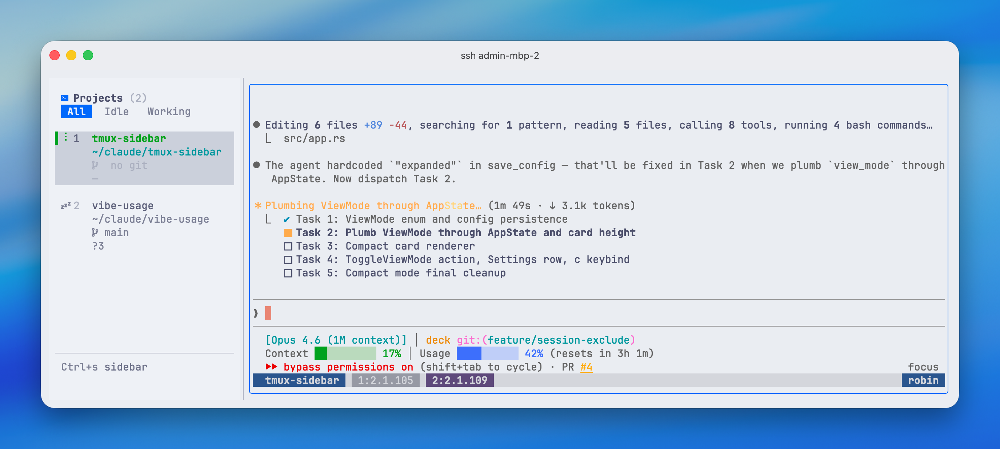

# deck

A terminal sidebar for browsing and switching tmux sessions. See your sessions, git status, and terminal output in one view.



## Features

- **Session sidebar** with git branch, ahead/behind, staged/modified/untracked counts
- **Instant switch** — navigate sessions with j/k or number keys, session switches as you move
- **Filter** sessions by All / Working / Idle
- **Reorder** sessions with Alt+Up/Down
- **Rename, kill, create** sessions without leaving the TUI
- **Mouse support** — click to switch, right-click for context menu, drag to resize sidebar
- **7 built-in themes** — Catppuccin Mocha, Tokyo Night, Gruvbox, Nord, Dracula, Catppuccin Latte, Claude Light
- **Horizontal & vertical** layouts, compact & expanded view modes, optional borders
- **Exclude patterns** — hide sessions by glob (`_*`) or regex (`/^test/`)
- **Tmux theme sync** — deck applies its color scheme to tmux automatically

## Install

```bash
curl -fsSL https://raw.githubusercontent.com/cross-entropy-ai/deck/master/install.sh | sh
```

Or with Homebrew:

```bash
brew tap cross-entropy-ai/tap
brew install deck
```

Or download a pre-built binary from [GitHub Releases](https://github.com/cross-entropy-ai/deck/releases).

## Usage

```bash
deck
```

Requires `tmux` installed and available in `PATH`. Run it inside a tmux session.

### Keybindings

| Key | Action |
|---|---|
| `Ctrl+S` | Toggle focus between sidebar and terminal |
| `j` / `k` | Navigate sessions |
| `1`-`9` | Jump to session by number |
| `Enter` | Switch to session and focus terminal |
| `x` | Kill session (with confirmation) |
| `f` | Cycle filter (All / Working / Idle) |
| `l` | Toggle horizontal/vertical layout |
| `b` | Toggle borders |
| `c` | Toggle compact/expanded view |
| `t` | Open settings |
| `Alt+Up/Down` | Reorder sessions |
| `h` / `?` | Help |
| `q` | Quit |

### Configuration

Config is stored at `~/.config/deck/config.json`:

```json
{
  "theme": "Catppuccin Mocha",
  "layout": "horizontal",
  "show_borders": true,
  "sidebar_width": 28,
  "view_mode": "expanded",
  "exclude_patterns": ["_*"]
}
```

Exclude patterns support glob syntax (`_*`, `scratch*`) and regex wrapped in slashes (`/^test-.+$/`).

## Build from source

```bash
cargo build --release
./target/release/deck
```
