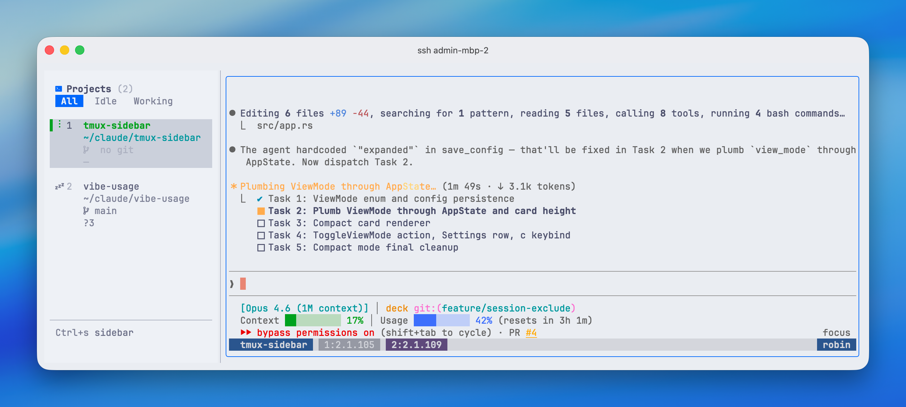

# deck

A tmux session sidebar inside your terminal: browse and switch sessions while the main area stays attached to the current session’s PTY—no full-screen “menu replaces your shell” workflow.



## What deck is

- **A sidebar UI for tmux**: a [ratatui](https://github.com/ratatui-org/ratatui) TUI that lists sessions on the side; the main pane shows real terminal output for the selected session.
- **Session-first workflow**: create, rename, kill, reorder, and filter sessions; optional git hints, themes, keybindings, and preferences in `~/.config/deck/config.json`.
- **A local helper**: it expects `tmux` already installed and on your `PATH`. If tmux is missing, deck exits.

## What deck is not

- **Not a tmux replacement**: it does not implement multiplexing or attach/detach semantics. deck is a front end in your terminal; tmux remains the owner of sessions and processes.
- **Not a general “terminal IDE” or system terminal app**: a single binary plus TUI—not a host like iTerm2 or Windows Terminal.
- **Not a window/pane-centric tmux manager**: interaction centers on the **session** list and main PTY; complex pane layouts stay in your normal tmux habits.
- **Not remote sync or collaboration**: it does not sync sessions across machines or manage team access.

## What deck helps you do

- **Switch sessions with less disruption**: pick a session in the sidebar and keep the main pane connected—fewer “full-screen menu → back to shell” context switches.
- **Do common session work from the sidebar**: filter, reorder, create/rename/kill (see the key table below and in-app `h` / `?` help).
- **Persist preferences**: theme, layout, sidebar size, exclude rules, plugin-style commands (each in its own PTY) live in config and load on the next start.
- **Single instance by default**: avoids running two decks fighting over the same terminal state; use `deck --force` to take over explicitly (see `--help`).

## What deck does not help you do

- **It does not install or configure tmux for you**: versions, socket, and `tmux.conf` are still yours.
- **It does not guarantee every nested setup is safe**: running deck inside tmux (and similar nesting) has guards and limits; tricky nesting is still your call.
- **It does not replace day-to-day work inside a session**: shell, editor, splitting panes or switching windows in tmux work as before; deck mainly reduces **session-level** navigation and housekeeping.

## Features at a glance

- **Session-first navigation**: browse and switch tmux sessions from the sidebar.
- **Session operations**: create, rename, kill, reorder, filter.
- **Main pane stays live**: the large pane stays attached to the selected session instead of being replaced by a full-screen menu.
- **Keyboard and mouse**: key navigation, click to switch, context menu on right-click (when your terminal supports it).

For implementation details, see [`docs/ARCHITECTURE.md`](docs/ARCHITECTURE.md).

## Install

```bash
curl -fsSL https://raw.githubusercontent.com/cross-entropy-ai/deck/main/install.sh | sh
```

Or with Homebrew:

```bash
brew install cross-entropy-ai/tap/deck
```

Or download a pre-built binary from [GitHub Releases](https://github.com/cross-entropy-ai/deck/releases).

## Usage

```bash
deck
```

**Requirements**: `tmux` installed and available on `PATH`. If there are no sessions, deck tries to create a detached session named `default` so it can start.

**Config**: `~/.config/deck/config.json`

deck runs two panes. The **sidebar** lists your tmux sessions with working directory, git branch, and idle time. The **main pane** stays attached to the focused session so the terminal never disappears behind a menu.

### Focus and navigation

The sidebar and main pane each capture keys in their own mode. Press `Ctrl+S` at any time to toggle focus between them.

With the sidebar focused:

| Key | Action |
|---|---|
| `j` / `k` or `↑` / `↓` | Move cursor |
| `Enter` | Switch tmux to the highlighted session and jump into it |
| `1`–`9` | Jump straight to the Nth visible session |
| `f` | Cycle filter (All / Idle / Working) |
| `x` | Kill the selected session (confirm with `y`) |
| `Alt+↑` / `Alt+↓` | Reorder sessions |
| `r` | Reload `~/.config/deck/config.json` |
| `h` or `?` | Show the full in-app help |
| `q` | Quit |

Click a session to switch, right-click for a context menu (rename, kill, new session), or drag the edge between panes to resize.

### Customize

Most look-and-feel options have in-app toggles while the sidebar is focused:

| Key | Action |
|---|---|
| `s` | Open settings |
| `t` | Theme picker |
| `b` | Toggle pane borders |
| `l` | Horizontal ↔ vertical layout |
| `c` | Expanded ↔ compact session cards |

Anything not exposed as a hotkey lives in `~/.config/deck/config.json` — themes, keybindings, exclude patterns, plugins, update-check mode. Edit the file in your editor, then press `r` in the sidebar: deck re-applies the config without restarting. A parse error surfaces as a red banner with the line/column; the previous state stays in place so you can fix the JSON and press `r` again.

Full keybinding list and rebinding syntax are rendered in-app via `h` / `?`.

#### Plugins

Bind a key to any command and run it inside its own deck pane. Add entries to your config:

```json
{
  "plugins": [
    { "name": "GPU", "command": "nvtop", "key": "g" },
    { "name": "Top", "command": "btop",    "key": "m" }
  ]
}
```

Each plugin shows up in the sidebar; press its key while the sidebar is focused to launch it in the main pane. `Esc` returns to the terminal session.

## Develop

```bash
cargo run
```

## Build from source

```bash
cargo build --release
./target/release/deck
```

You still need tmux installed locally to run it.
